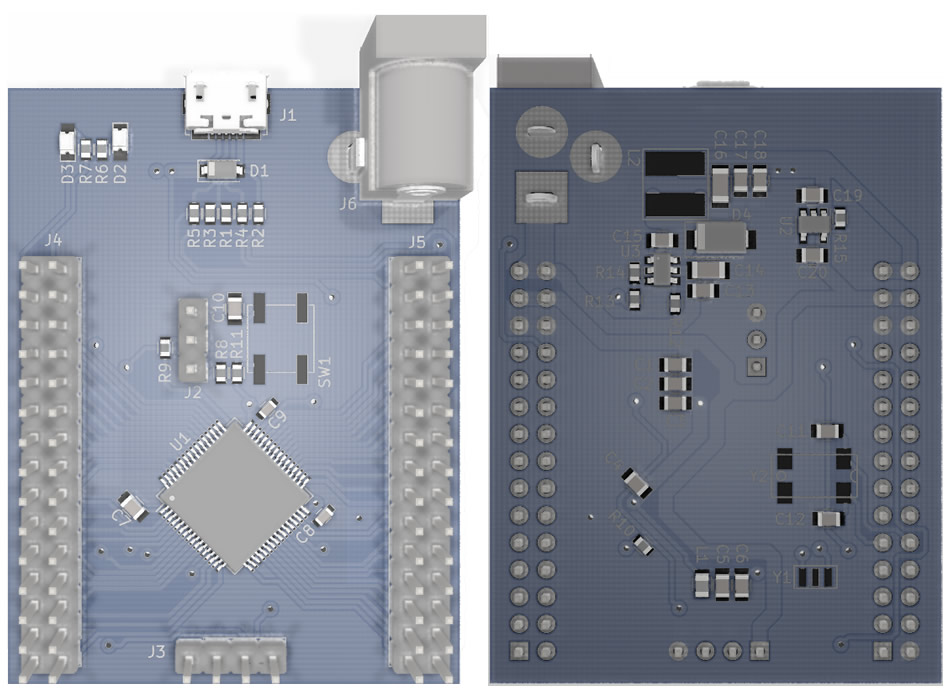
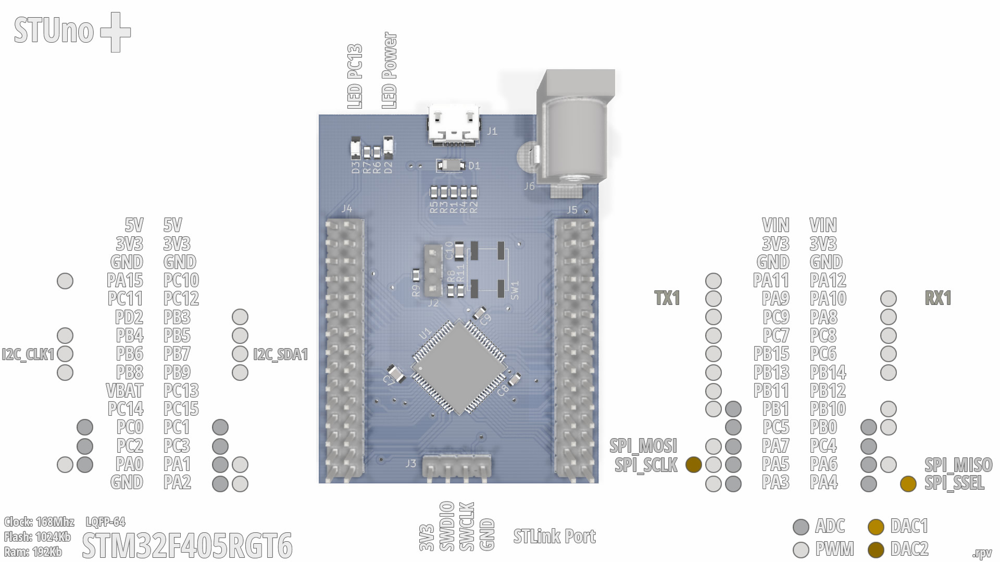
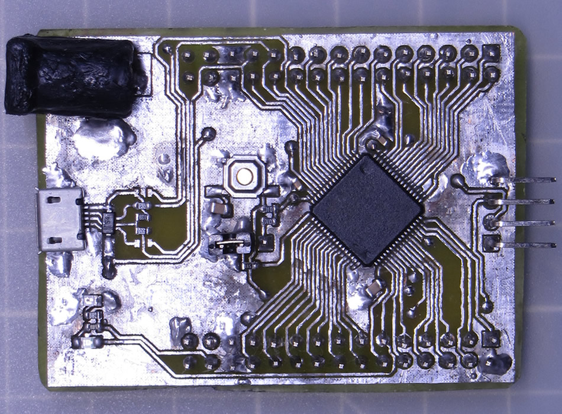
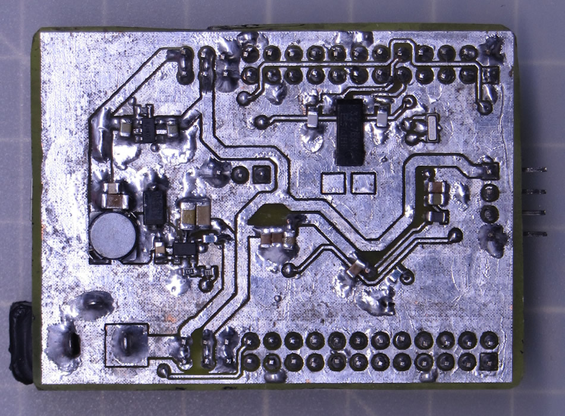
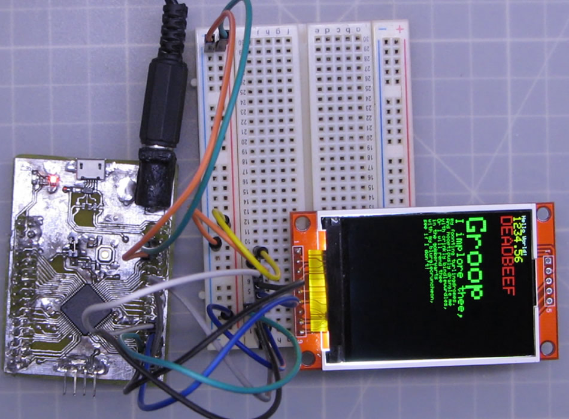

# STM32F405RGT6 STUno+

An ST development board based on the STM32F405RGT6/STM32F405RG (Clock: 168MHz, Flash: 1024Kb, Ram:194Kb) MCU (LQFP-64) compatible with STM32Duino (Arduino).

## Pinout:

## Files and Folders description

- **RBOARD_F405RGT6** it's the variant board for the STM32 Arduino Core.
- **rSTM32F405RGT6_B** it's the KiCAD 5.1.2 project.
- **rSTM32F405RGT6.schematic.pdf** the schematic.

## Install

_pending..._

## The real board

**Front**

_*I submerge the boards on a painters solvent bath to clean the flux residue which I haven't any problem until the DC jack came, as you see, didn't took the solvent bath kindly :P_

**Back**

_*The footprint for the second crystal (Y2) was wrong on this board but it's already corrected on the KiCAD files._

## Running some tests

The **STUno+** running the Adafruit ILI9341 library over hardware SPI.

_Video in progress..._

